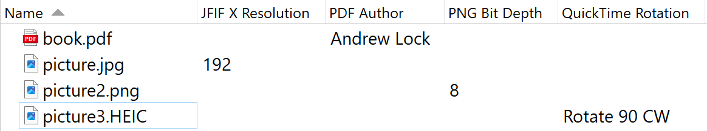

# DirectoryOpus-ExifToolColumns-Plugin
A DirectoryOpus plugin to add extra columns provided by ExifTool.

# How to use
* Install [DOpus-Scripting-Extensions](https://github.com/PolarGoose/DOpus-Scripting-Extensions)
  * Download the MSI from the [releases page](https://github.com/PolarGoose/DOpus-Scripting-Extensions/releases) and install it
* Download the `.js` file from [this project's releases page](https://github.com/PolarGoose/DirectoryOpus-ExifToolColumns-Plugin/releases)
* Copy the `.js` file to the `%AppData%\GPSoftware\Directory Opus\Script AddIns` folder
* Modify `exifToolTagNamesDatabase` variable at the beginning of the script file.
  * You can copy-paste the lines from the [TagNamesDatabase.txt](https://github.com/PolarGoose/DirectoryOpus-ExifToolColumns-Plugin/blob/main/doc/TagNamesDatabase.txt)
* Optionally, you can specify the extensions white list in the script configuration.

# References
* Discussion of this project on DOpus forum: [ExifTool Custom Columns 2](https://resource.dopus.com/t/dopus-scripting-extensions-project-wild-idea/55000)
